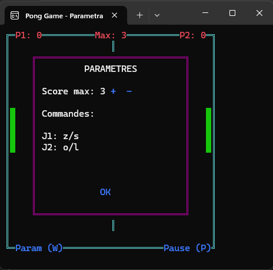

# Jeu de Pong

## Description
Ce programme est une implémentation du jeu classique Pong en C++ utilisant la console Windows. Il propose une version améliorée avec des fonctionnalités supplémentaires comme un menu de paramètres, des effets sonores et une interface colorée.

## Fonctionnalités
- **Deux joueurs** : Contrôlez les raquettes avec les touches Z/S (Joueur 1) et O/L (Joueur 2)
- **Système de score** : Premier joueur à atteindre le score maximum gagne
- **Paramètres configurables** :
  - Modification du score maximum
  - Affichage des contrôles
- **Effets sonores** : Sons différents pour les rebonds et les points marqués
- **Interface graphique** :
  - Bordures colorées
  - Raquettes et balle visibles
  - Affichage des scores en temps réel
- **Menu pause** : Mettre le jeu en pause avec la touche P
- **Redimensionnement automatique** de la console pour une meilleure expérience

## Aperçu du jeu
 


## Contrôles
- **Joueur 1** : 
  - Monter : Z
  - Descendre : S
- **Joueur 2** : 
  - Monter : O
  - Descendre : L
- **Pause** : P
- **Paramètres** : W
- **Quitter** : Q

## Installation et Exécution
### Prérequis
- Un compilateur compatible C++ (MinGW, MSVC, etc.)

### Compilation
1. Ouvrez un terminal ou une invite de commande.
2. Compilation sous Windows (MinGW) :
   ```sh
   g++ Src/main.cpp Src/GameManager.cpp Src/Ball.cpp Src/Paddle.cpp -IInc -o pong.exe
   ```
3. Exécution :
   ```sh
    pong.exe
   ```

## Paramètres
Appuyez sur W pendant le jeu pour accéder au menu des paramètres où vous pouvez :
- Augmenter/diminuer le score maximum avec +/-
- Voir les contrôles actuels
- Quitter les paramètres avec Entrée

## Auteur
Ce programme a été développé en C++ en utilisant les API Windows pour la gestion de la console.

## Licence
Ce code est fourni à titre éducatif et peut être librement utilisé et modifié.
